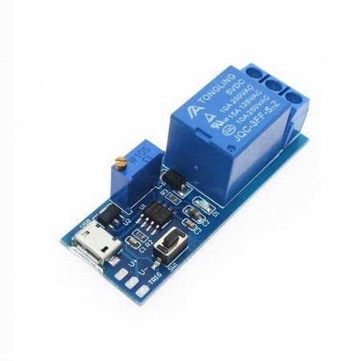

# Principais componentes

Alguns dos componentes eletrônicos mais usados e sua aplicação

## Resistor


Como o próprio nome já indica, a função do componente é *resistir* à passagem de corrente elétrica, reduzindo sua tensão. Dessa forma, protege outros componentes ao garantir que recebam somente a voltagem correta.

As sequência de cores impressa representa a *resistência*, que é medida em Ohms. Para se identificar a resistência, basta comparar com uma tabela de conversão. A primeira faixa representa a primeira coluna da tabela, com a faixa mais espaçada à esquerda.


Pode-se calcular a resistência necessária a partir da fórmula abaixo. O valor deve ser sempre arredondado *para cima*, ou seja, utilizar o resistor imediatamente maior que o resultado da equação.


```plain
R: resistência em ohms
V0: voltagem atual do circuito
Vp: voltagem pretendida
C: corrente do componentes que se pretende ligar
```

## Potenciômetro

Resistor variável. Permitir regular a resistência de 0 até um determinado limite. Possui três terminais, onde um desses é uma saída analógica que pode ser lida por um Arduino.


## Capacitor

Ao ser carregado, armazena energia em um campo elétrico para ser liberada posteriormente. As aplicações vão desde meramente armazenar a carga, agindo como uma espécie de bateria, a estabilizador de tensão em circuitos retificadores, transformando corrente alternada em corrente contínua.

É importante tomar cuidado quando se lida com capacitores, especialmente em circuitos de voltagens mais altas. Mesmo desligados, ainda podem conter carga. Para evitar o risco de um choque elétrico, pode-se fechar um curto dos terminais do capacitor, o que fará com que a carga seja liberada instaneamente.

Há diversos tipos, variando em tamanho e *capacitância* (medida em Farad).


Alguns capacitores são polarizados, como o eletrolítico. Inverter os pólos causará um curto e o componente pode até estourar. Uma seta, geralmente com um sinal de menos, indica qual o sentido da corrente.

## Diodo

Permite que a corrente do circuito flua em apenas um sentido, evitando que ela "volte". Por exemplo, pode ser usado antes de um motor elétrico para evitar que este gere alguma carga ao ser movido manualmente e danifique algum capacitor. Também são usados para criar lâmpadas de LED (Light Emitting Diode).

A faixa cinza indica o pólo negativo do diodo. No caso de LEDs, o negativo é o terminal mais curto.


## Transistor

Controla a passagem da corrente, agindo como uma espécie de "interruptor eletrônico".

Possui três terminais: coletor, emissor e base. Quando a base é energizada, permite que a corrente flua entre coletor e emissor.


## Relé

Semelhante a um transistor, mas projetado para voltagens maiores. Permite, por exemplo, ligar uma lâmpada a partir de um Arduino.


