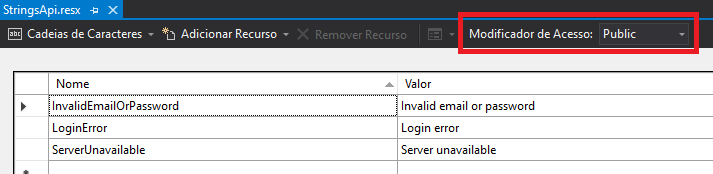
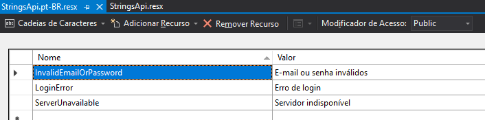

# Localização (tradução)

A globalização é o design e o desenvolvimento de aplicativos que são executados em várias localizações. Por exemplo, a globalização dá suporte a interfaces do usuário localizadas e a dados regionais para usuários em culturas diferentes. WPF fornece recursos de design globalizados, incluindo layout automático, assemblies satélite e atributos e comentários localizados.
A localização é a tradução de recursos do aplicativo em versões localizadas para culturas específicas às quais o aplicativo dá suporte.
[Documentação](https://docs.microsoft.com/pt-br/dotnet/framework/wpf/advanced/wpf-globalization-and-localization-overview)

## Layout automático

Antes de começar a traduzir o projeto, é interessante revisar o layout da aplicação para se certificar de que irá se adaptar a textos em diferentes idiomas, uma vez que estes podem ser de tamanhos diferentes.

Há um [tópico na documentação oficial](https://docs.microsoft.com/pt-br/dotnet/framework/wpf/advanced/use-automatic-layout-overview) com algumas dicas de como se fazer isso, mas basicamente, a ideia é fugir um pouco do designer de janelas do Visual Studio e ir programando em XAML, usando o código gerado pela IDE como base.

Por mais útil e prática que a ferramenta seja, permitindo adicionar componentes arrastando e soltando, ela se limita a utilizar [Grid](https://docs.microsoft.com/pt-br/dotnet/api/system.windows.controls.grid) com posições fixas (posicionamento por pixels), o que fará com que o texto quebre e/ou fique cortado caso a versão traduzida seja mais longa do que o original.

Outros tipos de painéis, como DockPanel ou StackPanel, permitem posicionar os componentes de forma relativa, o que minimiza esse problema. [Este tópico da documentação oficial](https://docs.microsoft.com/pt-br/dotnet/api/system.windows.controls.dockpanel) compara os diferentes painéis disponíveis no WPF.

## Arquivos de recurso

O tutorial mais simples que encontrei foi [esse artigo do Code Project](https://www.codeproject.com/Articles/299436/WPF-Localization-for-Dummies).

Basicamente, ele sugere criar um arquivo `.resx` (pode ser qualquer nome) através do Visual Studio e adicionar à pasta `Properties` do projeto. Este arquivo é um dicionário de chave/valor. O idioma padrão é `en-US`, portanto basta adicionar as traduções para o inglês. As chaves não podem conter caracteres especiais.



Feito isso, só criar outro arquivo com o mesmo nome, mas adicionando a [*language tag*](http://msdn.microsoft.com/en-us/goglobal/bb896001.aspx) como sufixo. Depois, copiar estas mesmas chaves para os demais arquivos e adicionar as traduções correspondentes.



Para facilitar a edição dos diferentes idiomas, pode-se usar o [Zeta Resource Editor](https://www.zeta-resource-editor.com). O software permite adicionar todos os arquivos de recurso da solução, separados por projeto.

## Definir o idioma da aplicação

Para definir o idioma, basta alterar a `CultureInfo` da interface:

```csharp
    CultureInfo.CurrentUICulture = new CultureInfo("pt-BR");
```

Este método altera o idioma da Thread atual, portando deve ser chamada pela janela principal da aplicação, de forma que subjanelas sejam abertas no idioma selecionado.

Outro ponto importante é que isto não irá "redesenhar" a tela, portanto deve ser chamado **antes** do método `InitializeComponents()`.

## Usando os recursos

No cabeçalho do arquivo XAML (tag `Window`), adicione o namespace `Properties` do projeto:

```xml
<Window ...
    xmlns:p="clr-namespace:NomeDoProjeto.Properties">
```

Feito isso, só buscar o recurso a partir da chave:

```xml
    <TextBlock FontSize="11" Text="{x:Static p:ArquivoDeRecursos.Chave}"  />
```

Da mesma forma, pode-se buscar os recursos em C#:

```csharp
using Projeto.Properties;
    ...
    MessageBox.Show(ArquivoDeRecursos.Chave);
```
