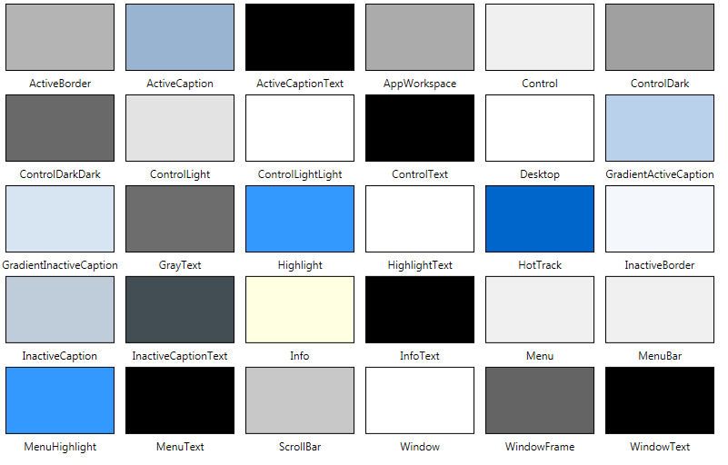

# Cores padrão (`SystemColors`)

Por padrão, o programa irá "importar" as cores do tema do Windows. Caso precise acessar essas cores, pode-se usar a classe estática `System.Windows.SystemColors`. A classe define diversas "categorias", que são as cores definidas pelo usuário a partir das configurações do sistema.

Para cada categoria, há sempre três propriedades:

- `Brush`: Objeto [SolidColorBrush](https://docs.microsoft.com/en-us/dotnet/api/system.windows.media.solidcolorbrush) usado pelo WPF para desenhar a janela
- `BrushKey`: O código hexadecimal para esse objeto (*não é* o código da cor)
- `Color`: Um objeto que representa a cor a partir de uma estrutura [Color](https://docs.microsoft.com/en-us/dotnet/api/system.windows.media.color)

Para aplicar estas cores através do código C#, usa-se o objeto Brush:

```csharp
Btn.Background = SystemColors.HighlightBrush;
```

No XAML, usa-se um `DynamicResource` com o código do objeto:

```xml
<Button Name="Btn" Content="Clique aqui" HorizontalAlignment="Center" Click="Btn_Click"
    Background="{DynamicResource {x:Static SystemColors.HighlightBrushKey}}" />
```

A imagem abaixo, retirada [desse site](https://wpf.2000things.com/2011/02/20/223-predefined-system-colors), contém as cores padrão do Windows:


